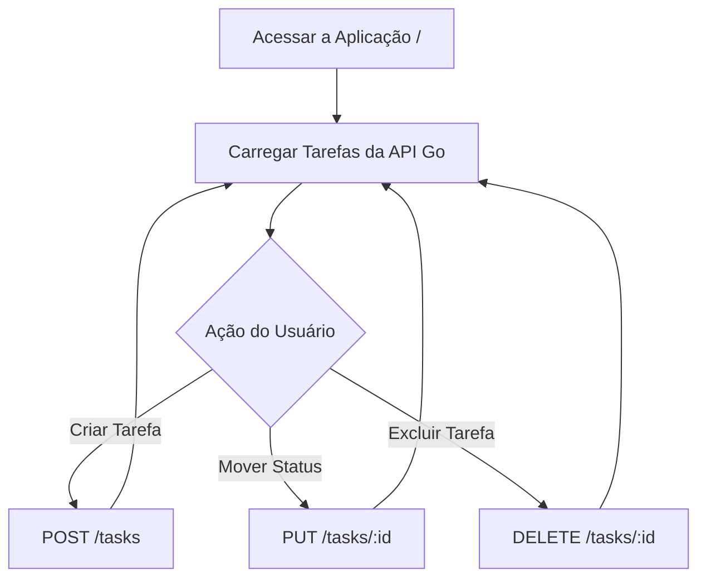

# Mini Kanban - Aplicação Fullstack (Go + React)

Projeto de automação e gerenciamento de tarefas em formato Kanban, desenvolvido com backend em Go (Golang) e frontend em React (Vite).

---

## Escopo Mínimo (MVP)

A aplicação conta com um CRUD completo de tarefas integradas:
- **Criar (`POST`):** Você pode adicionar novas tarefas e ainda especificar o Título e a Descrição.
- **Listar (`GET`):** As tarefas são exibidas em 3 colunas simples de entender: A Fazer, Em Progresso e Concluído.
- **Atualizar (`PUT`):** A cada atualização feita, as taregas de movem dinamicamente entre as colunas.
- **Deletar (`DELETE`):** Remove tarefas da aplicação.

---

## Arquitetura e Tecnologias

- **Backend:** Go (Golang) com pacote nativo `net/http`, gerenciamento de concorrência via `sync.Mutex` e controle de CORS.
- **Frontend:** React com Vite, Hooks (`useState`, `useEffect`) e requisições HTTP via `Fetch API`.
- **Estilização:** CSS3 puro focado em responsividade e UX intuitiva.

---

## User Flow

## Como Executar o Projeto

### 1. Iniciar o Backend
No terminal, entre na pasta do backend com o comando: **cd backend**

Após entrar, execute com o comando: **go run main.go**

Aqui o servidor estará rodando em http://localhost:8080

### 2. Iniciar o Frontend
Após executar os comandos do Backend, abra uma nova Aba no Terminal e entre na pasta do Frontend com o comando: **cd frontend**

Em seguida, digite o comando: **npm run dev**

Após o comando, vai aparecer o link: http://localhost:5173 

Copie e acesse no seu navegador.
